# üåü (Tugas Akhir) Proyek Web Artikel - CodeIgniter 4 & VueJS

Dokumen ini adalah ringkasan proyek pembuatan aplikasi artikel berbasis **CodeIgniter 4** dengan frontend **VueJS**. Proyek ini mencakup latihan CRUD, integrasi REST API, AJAX, dan pagination dinamis.

---

## ‚ú® Deskripsi Singkat

Aplikasi ini dikembangkan untuk mempelajari:

- Struktur dasar proyek CodeIgniter 4.
- Relasi tabel menggunakan Query Builder.
- Implementasi REST API untuk pengelolaan data artikel.
- Pemanfaatan VueJS sebagai antarmuka pengguna modern.
- Fitur AJAX tanpa reload halaman.

---

## üöÄ Demo Online

| Modul        | Tautan                                                                                     |
| ------------ | ------------------------------------------------------------------------------------------- |
| Akses Web  | https://denta-web.infinityfreeapp.com/                               


---

## 🛠️ Fitur Utama

- Manajemen artikel (Tambah, Edit, Hapus).
- Kategori artikel dan filter pencarian.
- Pagination AJAX interaktif.
- REST API untuk CRUD data.
- VueJS untuk konsumsi API secara real-time.

---

⚙️ Cara Menjalankan

1. Clone repository
2. Konfigurasi database di .env
3. Jalankan server:

```php
php spark serve
```
4. Akses aplikasi via browser.

üìë Teknologi
- PHP 8 & CodeIgniter 4
VueJS 3
- MySQL
- jQuery
- VueJS 3
- Axios


üìå Catatan
- Pastikan folder image/ memiliki izin tulis.
- Endpoint REST API tersedia di http://localhost:8080/post.
- Frontend VueJS memanfaatkan endpoint API yang sama.


## 👤 Informasi Mahasiswa

| **Kolom**         | **Isi**                    |
| ----------------- | --------------------------- |
| **Nama**          | Denta Pramudya              |
| **NIM**           | 312310464                   |
| **Kelas**         | TI.23.A.2                   |
| **Mata Kuliah**   | Pemrograman Web 2           |
| **Dosen Pengampu**| Agung Nugroho S.Kom., M.Kom |


# Praktikum 7 - 11: PHP Framework (CodeIgniter 4) & Vuejs

<p align="center">
 
 
 
 
 
</p>

Dokumentasi ini berisi rangkuman materi dan latihan dalam **Praktikum 7-11** dari mata kuliah **Pemorograman Web 2**.  
Setiap praktikum membahas berbagai aspek penggunaan **PHP Framework CodeIgniter 4**, mulai dari dasar hingga konsep lanjutan seperti **Relasi Tabel dan Query Builder**, **Ajax**, dan **Implementasi AJAX Pagination dan Search**, **REST API**.

Praktikum ini bertujuan untuk memberikan pemahaman mendalam tentang **pengembangan aplikasi web berbasis CodeIgniter 4**, termasuk konfigurasi awal, struktur proyek, serta implementasi fitur-fitur esensial dalam sebuah aplikasi web.


## üìö Daftar Praktikum

Berikut ini adalah daftar praktikum yang telah diselesaikan dalam mata kuliah **Pemrograman Web 2**, dengan fokus pada penggunaan **PHP Framework CodeIgniter 4**, **MySQL**, **jQuery**, dan **VueJS**:

| No  | Judul Praktikum                                                                                                | Deskripsi                                                                                                                                                                                                                                                                                                                                           |
| --- | -------------------------------------------------------------------------------------------------------------- | --------------------------------------------------------------------------------------------------------------------------------------------------------------------------------------------------------------------------------------------------------------------------------------------------------------------------------------------------- |
| 1️⃣  | [Praktikum 7: Relasi Tabel dan Query Builder](#praktikum-7-relasi-tabel-dan-query-builder)                     | Memahami konsep relasi antar tabel dalam database. Mengimplementasikan relasi **One-to-Many**. Menggunakan **Query Builder** untuk melakukan operasi join dan menampilkan data yang berelasi.                                                                                                                                                       |
| 2️⃣  | [Praktikum 8: Ajax](#praktikum-8-ajax)                                                                         | Penerapan AJAX (Asynchronous JavaScript and XML) dalam pengembangan aplikasi web menggunakan framework CodeIgniter 4 dan pustaka jQuery. AJAX memungkinkan komunikasi antara client dan server tanpa melakukan reload seluruh halaman, sehingga pengalaman pengguna menjadi lebih cepat dan dinamis.                                                |
| 3️⃣  | [Praktikum 9: Implementasi AJAX Pagination dan Search](#praktikum-9---implementasi-ajax-pagination-dan-search) | Praktikum ini bertujuan untuk mengimplementasikan fitur **pencarian (search)** dan **pagination (halaman)** pada data artikel menggunakan teknik **AJAX** di dalam framework **CodeIgniter 4**. Dengan teknik ini, data akan diambil dari server tanpa harus me-refresh halaman, sehingga dapat meningkatkan **User Experience (UX)** aplikasi web. |
| 4️⃣  | [Praktikum 10: REST API dengan CodeIgniter 4](#praktikum-10---rest-api-dengan-codeigniter-4)                   | Praktikum ini membahas pembuatan **RESTful API** menggunakan framework **CodeIgniter 4**. Mahasiswa akan mengembangkan fitur **CRUD (Create, Read, Update, Delete)** yang dapat diakses oleh berbagai platform menggunakan HTTP method (`GET`, `POST`, `PUT`, `DELETE`) dan diuji melalui aplikasi **Postman**.                                     |
| 5️⃣  | [Praktikum 11: VueJS dan Frontend API](#praktikum-11-vuejs-dan-frontend-api)                                   | Praktikum ini membahas integrasi **VueJS 3** dengan **REST API** yang telah dibuat sebelumnya. Mahasiswa akan membangun **tampilan frontend interaktif** untuk data artikel, serta mengimplementasikan fitur **CRUD (Create, Read, Update, Delete)** menggunakan VueJS dan Axios tanpa reload halaman.                                              |

Setiap praktikum di atas didokumentasikan lengkap dengan **kode, penjelasan, serta screenshot hasilnya** untuk memperkuat pemahaman dan menjadi portofolio pengembangan web berbasis framework.

---

# Praktikum 7: Relasi Tabel dan Query Builder

## 🎯 Tujuan Praktikum

1. Memahami konsep relasi antar tabel dalam database.
2. Mengimplementasikan relasi One-to-Many.
3. Melakukan query dengan join tabel menggunakan Query Builder.
4. Menampilkan data dari tabel yang berelasi.

---

## ⚙️ Persiapan Awal

1. Pastikan MySQL Server aktif.
2. Buka kembali folder proyek `lab7_php_ci` di VSCode.
3. Jalankan database `lab_ci4`.

---

## 1. Membuat Tabel `kategori`

```sql
CREATE TABLE kategori (
    id_kategori INT(11) AUTO_INCREMENT,
    nama_kategori VARCHAR(100) NOT NULL,
    slug_kategori VARCHAR(100),
    PRIMARY KEY (id_kategori)
);
```

🖼️ _Screenshot hasil pembuatan tabel di phpMyAdmin:_

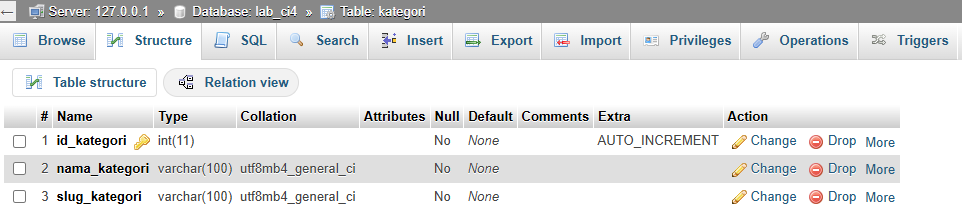

## 2. Mengubah Tabel artikel

```sql
ALTER TABLE artikel
ADD COLUMN id_kategori INT(11),
ADD CONSTRAINT fk_kategori_artikel
FOREIGN KEY (id_kategori) REFERENCES kategori(id_kategori);
```

## 3. Membuat Model KategoriModel.php

Path: app/Models/KategoriModel.php

```php
<?php

namespace App\Models;

use CodeIgniter\Model;

class KategoriModel extends Model
{
    protected $table = 'kategori';
    protected $primaryKey = 'id_kategori';
    protected $useAutoIncrement = true;
    protected $allowedFields = ['nama_kategori', 'slug_kategori'];
}
```

## ✏️ 4. Memodifikasi Model ArtikelModel.php

Tambahkan method untuk mengambil data artikel beserta nama kategori.

```php
<?php

namespace App\Models;

use CodeIgniter\Model;

class KategoriModel extends Model
{
    protected $table = 'kategori';
    protected $primaryKey = 'id_kategori';
    protected $allowedFields = ['nama_kategori'];

     public function getAllKategori()
    {
        return $this->findAll();
    }
}
```

## üîß 5. Memodifikasi Controller Artikel.php

Gunakan method getArtikelDenganKategori() pada method index dan admin_index.
Tambahkan juga filter berdasarkan kategori_id.

Contoh pengambilan data artikel dengan join:

```php
<?php

namespace App\Controllers;

use App\Models\ArtikelModel;
use App\Models\KategoriModel;
use CodeIgniter\Exceptions\PageNotFoundException;

class Artikel extends BaseController
{
    // Menampilkan daftar artikel
    public function index()
    {
        // Membuat objek model
        $artikelModel = new ArtikelModel();
        $kategoriModel = new KategoriModel();

        // Mengambil data artikel beserta kategori
        $artikel = $artikelModel->getArtikelDenganKategori();

        // Mengambil daftar kategori
        $kategori = $kategoriModel->getAllKategori();

        // Mengirimkan data ke view
        return view('artikel/index', [
            'artikel' => $artikel,
            'kategori' => $kategori
        ]);
    }

    // Menampilkan artikel berdasarkan slug
  public function view($slug)
{
    $model = new ArtikelModel();
    // Gabungkan artikel dengan kategori
    $artikel = $model->select('artikel.*, kategori.nama_kategori')
                     ->join('kategori', 'kategori.id_kategori = artikel.id_kategori', 'left')
                     ->where(['slug' => $slug])
                     ->first();

    if (!$artikel) {
        throw PageNotFoundException::forPageNotFound();
    }

    $title = $artikel['judul'];
    return view('artikel/detail', compact('artikel', 'title'));
}


    // Menampilkan artikel admin dan pencarian
  public function admin_index()
{
    $title = 'Daftar Artikel';
    $q = $this->request->getVar('q') ?? '';  // Ambil pencarian dari URL
    $kategoriId = $this->request->getVar('kategori'); // Ambil kategori dari URL

    // Model Artikel
    $model = new ArtikelModel();

    // Menggabungkan artikel dengan kategori
    $model->select('artikel.*, kategori.nama_kategori')
          ->join('kategori', 'kategori.id_kategori = artikel.id_kategori', 'left');

    // Filter berdasarkan pencarian jika ada
    if (!empty($q)) {
        $model->like('judul', $q)->orLike('isi', $q);
    }

    // Filter berdasarkan kategori jika ada
    if (!empty($kategoriId)) {
        $model->where('artikel.id_kategori', $kategoriId);
    }

    // Ambil artikel dan paginate
    $data = [
        'title'   => $title,
        'q'       => $q,
        'selectedKategori' => $kategoriId,
        'kategori' => (new KategoriModel())->findAll(), // Ambil kategori
        'artikel' => $model->paginate(5),  // Artikel per halaman
        'pager'   => $model->pager,  // Pagination
    ];

    return view('artikel/admin_index', $data);
}


   public function search()
{
    $q = $this->request->getGet('q');  // Ambil query pencarian dari URL
    $kategoriId = $this->request->getGet('kategori');  // Ambil kategori yang dipilih

    // Ambil model artikel
    $artikelModel = new \App\Models\ArtikelModel();
    $query = $artikelModel->where('1=1');  // Mulai query dengan kondisi true

    // Filter berdasarkan kata kunci jika ada
    if ($q) {
        $query = $query->like('judul', $q)->orLike('isi', $q);
    }

    // Filter berdasarkan kategori jika ada
    if ($kategoriId) {
        $query = $query->where('id_kategori', $kategoriId);
    }

    // Ambil artikel yang sesuai dengan filter
    $artikel = $query->findAll();

    // Ambil data kategori untuk dropdown
    $kategoriModel = new \App\Models\KategoriModel();
    $kategori = $kategoriModel->findAll();  // Pastikan kategori diambil dengan benar

    // Kirim data ke view
    return view('artikel/admin_index', [
        'q' => $q,
        'selectedKategori' => $kategoriId,
        'kategori' => $kategori,  // Kirimkan kategori ke view
        'artikel' => $artikel,  // Kirimkan artikel yang ditemukan
    ]);
}


    // Menambahkan artikel baru
    public function add()
    {
        $validation = \Config\Services::validation();
        $validation->setRules([
            'judul' => 'required',
            'id_kategori' => 'required'
        ]);

        $isDataValid = $validation->withRequest($this->request)->run();

        if ($isDataValid) {
            $file = $this->request->getFile('gambar');
            $namaGambar = '';

            if ($file && $file->isValid()) {
                // Pindahkan file gambar ke folder gambar
                $file->move(ROOTPATH . 'public/gambar');
                $namaGambar = $file->getName();
            }

            $artikel = new ArtikelModel();
            // Pastikan slug unik
            $slug = url_title($this->request->getPost('judul'), '-', true);

            // Insert data artikel
            $artikel->insert([
                'judul'       => $this->request->getPost('judul'),
                'isi'         => $this->request->getPost('isi'),
                'id_kategori' => $this->request->getPost('id_kategori'),
                'slug'        => $slug,
                'gambar'      => $namaGambar,
            ]);
            return redirect()->to('/admin/artikel');
        }

        $title = "Tambah Artikel";
        $kategoriModel = new KategoriModel();
        $kategori = $kategoriModel->findAll();
        return view('artikel/form_add', compact('title', 'kategori'));
    }

    // Mengedit artikel
    public function edit($id)
    {
        $artikel = new ArtikelModel();
        $validation = \Config\Services::validation();
        $validation->setRules([
            'judul' => 'required',
            'id_kategori' => 'required'
        ]);

        $isDataValid = $validation->withRequest($this->request)->run();

        if ($isDataValid) {
            $dataUpdate = [
                'judul'       => $this->request->getPost('judul'),
                'isi'         => $this->request->getPost('isi'),
                'id_kategori' => $this->request->getPost('id_kategori'),
            ];

            $file = $this->request->getFile('gambar');
            if ($file && $file->isValid() && !$file->hasMoved()) {
                $file->move(ROOTPATH . 'public/gambar');
                $dataUpdate['gambar'] = $file->getName();
            }

            // Update artikel
            $artikel->update($id, $dataUpdate);
            return redirect()->to('/admin/artikel');
        }

        // Ambil data artikel untuk diedit
        $data = $artikel->where('id', $id)->first();
        $title = "Edit Artikel";
        $kategoriModel = new KategoriModel();
        $kategori = $kategoriModel->findAll();

        return view('artikel/form_edit', compact('title', 'data', 'kategori'));
    }

    // Menghapus artikel
    public function delete($id)
    {
        $artikel = new ArtikelModel();
        $artikel->delete($id);
        return redirect()->to('/admin/artikel');
    }
}
```

---

## üßæ 6. Memodifikasi View

### a. View artikel/index.php

```php
<?= $this->include('template/header'); ?>

<!-- Menampilkan Daftar Kategori -->
<div class="kategori-container">
  <h3>Kategori</h3>
  <ul>
    <?php if ($kategori): foreach ($kategori as $cat): ?>
    <li><a href="<?= base_url('/kategori/' . $cat['id_kategori']); ?>"><?= $cat['nama_kategori']; ?></a></li>
    <?php endforeach; else: ?>
    <li>No categories found</li>
    <?php endif; ?>
  </ul>
</div>

<!-- Artikel yang sudah ada -->
<div class="article-container">
  <?php if ($artikel): foreach ($artikel as $row): ?>
  <article class="entry">
    <div class="entry-meta">
      <span class="category"><?= $row['nama_kategori'] ?></span>
    </div>
    <h2 class="entry-title">
      <a href="<?= base_url('/artikel/' . $row['slug']); ?>"><?= $row['judul']; ?></a>
    </h2>
    <div class="entry-image">
      " alt="<?= $row['judul']; ?>">
    </div>
    <div class="entry-excerpt">
      <p><?= substr($row['isi'], 0, 200); ?>...</p>
      <a href="<?= base_url('/artikel/' . $row['slug']); ?>" class="read-more">Read More</a>
    </div>
  </article>
  <?php endforeach; else: ?>
  <article class="entry">
    <h2 class="entry-title">No articles found.</h2>
  </article>
  <?php endif; ?>
</div>


<?= $this->include('template/footer'); ?>
```

### b. View artikel/admin_index.php

Tambahkan dropdown filter kategori dan tampilkan kolom nama kategori.

```php
<?= $this->include('template/admin_header'); ?>
<form method="get" class="form-search">
  <input type="text" name="q" value="<?= $q; ?>" placeholder="Cari artikel...">

  <select name="kategori" id="kategori">
    <option value="">Semua Kategori</option>
    <?php if (isset($kategori) && !empty($kategori)): ?>
    <?php foreach ($kategori as $cat): ?>
    <option value="<?= $cat['id_kategori']; ?>" <?= ($selectedKategori == $cat['id_kategori']) ? 'selected' : ''; ?>>
      <?= $cat['nama_kategori']; ?>
    </option>
    <?php endforeach; ?>
    <?php else: ?>
    <option disabled>Tidak ada kategori</option>
    <?php endif; ?>
  </select>

  <input type="submit" value="Cari" class="btn">
</form>

<table class="table">
  <thead>
    <tr>
      <th>ID</th>
      <th>Judul</th>
      <th>Kategori</th>
      <th>Status</th>
      <th>Aksi</th>
    </tr>
  </thead>
  <tbody>
    <?php if($artikel): foreach($artikel as $row): ?>
    <tr>
      <td><?= $row['id']; ?></td>
      <td>
        <b><?= esc($row['judul']); ?></b>
        <p><small><?= esc(substr($row['isi'], 0, 50)); ?>...</small></p>
      </td>
      <td><?= esc($row['nama_kategori'] ?? 'Tidak ada'); ?></td>
      <td><?= esc($row['status']); ?></td>
      <td>
        <a class="btn btn-primary" href="<?= base_url('/admin/artikel/edit/' . $row['id']); ?>">Ubah</a>
        <a class="btn btn-danger" onclick="return confirm('Yakin menghapus data?');"
          href="<?= base_url('/admin/artikel/delete/' . $row['id']); ?>">Hapus</a>
      </td>
    </tr>
    <?php endforeach; else: ?>
    <tr>
      <td colspan="5">Belum ada data.</td>
    </tr>
    <?php endif; ?>
  </tbody>
  <tfoot>
    <tr>
      <th>ID</th>
      <th>Judul</th>
      <th>Kategori</th>
      <th>Status</th>
      <th>Aksi</th>
    </tr>
  </tfoot>
</table>

<!-- Pagination Section -->
<div class="pagination">
  <?= $pager->links() ?>
</div>


<?= $this->include('template/admin_footer'); ?>
```

### c. View artikel/form_add.php dan form_edit.php

`form _add.php`

```php
<div class="container">
  <div class="form-card">
    <div class="form-header">
      <h1 class="form-title"><?= $title ?></h1>
      <p class="form-subtitle">
        <?= isset($artikel['id']) ? 'Edit artikel yang sudah ada' : 'Buat artikel baru untuk dipublikasikan' ?></p>
    </div>

    <form action="" method="post" enctype="multipart/form-data" class="form-grid">
      <div class="form-group">
        <label for="judul" class="form-label">Judul Artikel <span>(wajib)</span></label>
        <input type="text" id="judul" name="judul" class="form-control"
          placeholder="Contoh: Cara Membuat Website Modern"
          value="<?= isset($artikel['judul']) ? esc($artikel['judul']) : '' ?>" required>
      </div>

      <div class="form-group">
        <label for="isi" class="form-label">Isi Artikel <span>(wajib)</span></label>
        <textarea id="isi" name="isi" class="form-control" placeholder="Tulis konten artikel Anda di sini..."
          required><?= isset($artikel['isi']) ? esc($artikel['isi']) : '' ?></textarea>
      </div>

      <div class="form-group">
        <label for="id_kategori" class="form-label">Kategori</label>
        <select id="id_kategori" name="id_kategori" class="form-control">
          <option value="">-- Pilih Kategori --</option>
          <?php foreach($kategori as $k): ?>
          <option value="<?= $k['id_kategori']; ?>"
            <?= (isset($artikel['id_kategori']) && $artikel['id_kategori'] == $k['id_kategori']) ? 'selected' : ''; ?>>
            <?= esc($k['nama_kategori']); ?>
          </option>
          <?php endforeach; ?>
        </select>
      </div>

      <div class="form-group">
        <label for="status" class="form-label">Status Publikasi</label>
        <select id="status" name="status" class="form-control">
          <option value="draft" <?= (isset($artikel['status']) && $artikel['status'] == 'draft') ? 'selected' : ''; ?>>
            Draft</option>
          <option value="publish"
            <?= (isset($artikel['status']) && $artikel['status'] == 'publish') ? 'selected' : ''; ?>>Publish</option>
        </select>
      </div>

      <div class="form-group">
        <label class="form-label">Gambar Utama</label>
        <div class="file-upload">
          <input type="file" id="gambar" name="gambar" class="file-upload-input" accept="image/*">
          <label for="gambar" class="file-upload-label">
            <div class="file-upload-icon">
              <svg xmlns="http://www.w3.org/2000/svg" fill="none" viewBox="0 0 24 24" stroke="currentColor">
                <path stroke-linecap="round" stroke-linejoin="round" stroke-width="2"
                  d="M7 16a4 4 0 01-.88-7.903A5 5 0 1115.9 6L16 6a5 5 0 011 9.9M15 13l-3-3m0 0l-3 3m3-3v12" />
              </svg>
              <div class="file-upload-text">Unggah Gambar</div>
              <div class="file-upload-hint">PNG, JPG maksimal 2MB</div>
            </div>
          </label>
        </div>
      </div>

      <button type="submit" class="btn">
        <svg class="btn-icon" xmlns="http://www.w3.org/2000/svg" width="16" height="16" viewBox="0 0 24 24" fill="none"
          stroke="currentColor" stroke-width="2" stroke-linecap="round" stroke-linejoin="round">
          <path d="M19 21H5a2 2 0 0 1-2-2V5a2 2 0 0 1 2-2h11l5 5v11a2 2 0 0 1-2 2z"></path>
          <polyline points="17 21 17 13 7 13 7 21"></polyline>
          <polyline points="7 3 7 8 15 8"></polyline>
        </svg>
        <?= isset($artikel['id']) ? 'Update Artikel' : 'Simpan Artikel' ?>
      </button>
    </form>
  </div>
</div>
```

---

`form_edit.php`

```php
<div class="container">
  <form action="" method="post" enctype="multipart/form-data">
    <div class="form-header">
      <h1><?= $title; ?></h1>
      <div class="action-buttons">
        <button type="button" class="btn btn-secondary" onclick="history.back()">
          <i class="fas fa-arrow-left"></i> Kembali
        </button>
        <button type="submit" class="btn btn-primary">
          <i class="fas fa-save"></i> Simpan Artikel
        </button>
      </div>
    </div>

    <div class="form-content">
      <div class="content-main">
        <div class="card">
          <div class="form-group">
            <label for="judul">Judul Artikel</label>
            <input type="text" name="judul" id="judul" value="<?= isset($data['judul']) ? $data['judul'] : ''; ?>"
              placeholder="Masukkan judul artikel" required>
          </div>
        </div>

        <div class="card">
          <div class="form-group">
            <label for="isi">Isi Artikel</label>
            <textarea name="isi" id="isi" placeholder="Tulis isi artikel..."
              required><?= isset($data['isi']) ? $data['isi'] : ''; ?></textarea>
          </div>
        </div>
      </div>

      <div class="content-sidebar">
        <div class="card">
          <div class="form-group">
            <label for="id_kategori">Kategori</label>
            <select name="id_kategori" id="id_kategori" required>
              <option value="">Pilih Kategori</option>
              <?php foreach ($kategori as $cat): ?>
              <option value="<?= $cat['id_kategori']; ?>"
                <?= (isset($data['id_kategori']) && $data['id_kategori'] == $cat['id_kategori']) ? 'selected' : ''; ?>>
                <?= $cat['nama_kategori']; ?>
              </option>
              <?php endforeach; ?>
            </select>
          </div>
        </div>

        <div class="card">
          <div class="form-group">
            <label>Gambar Artikel</label>
            <div class="file-input">
              <div class="file-upload">
                <input type="file" name="gambar" id="gambar" accept="image/*" onchange="previewImage(this)">
                <div class="upload-content">
                  <i class="fas fa-cloud-upload-alt"></i>
                  <p>Klik atau drop gambar di sini</p>
                </div>
              </div>

              <?php if (isset($data['gambar']) && $data['gambar']): ?>
              <div id="image-preview-container">
                " alt="Gambar Artikel" class="preview-image"
                  id="image-preview">
              </div>
              <?php else: ?>
              <div id="image-preview-container" style="display: none;">
                
              </div>
              <?php endif; ?>
            </div>
          </div>
        </div>
      </div>
    </div>
  </form>
</div>
```

---

## üß™ 7. Testing Fitur

- Menampilkan daftar artikel beserta kategori

- Menambah artikel baru dengan kategori

- Mengedit artikel dan ubah kategori

- Menghapus artikel

🖼️ _Screenshot Tampilan Daftar Artikel Beserta Ketegori:_

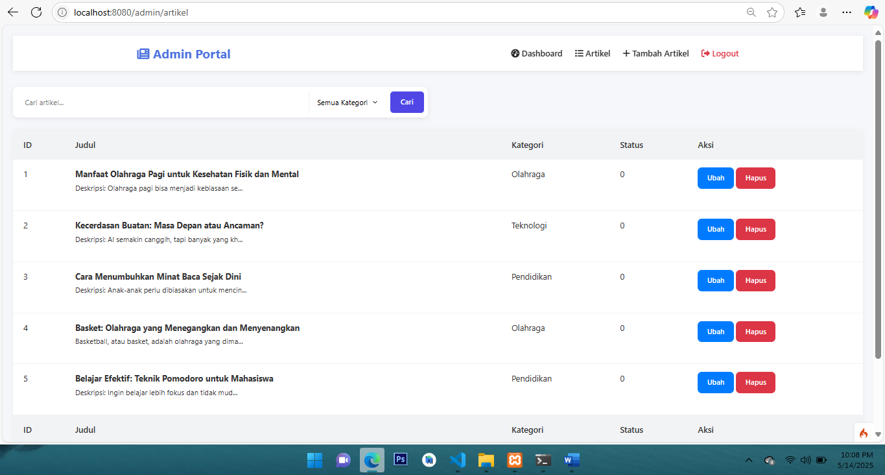

---

🖼️ _Screenshot Tampilan Tambah Artikel Baru dengan Kategori:_

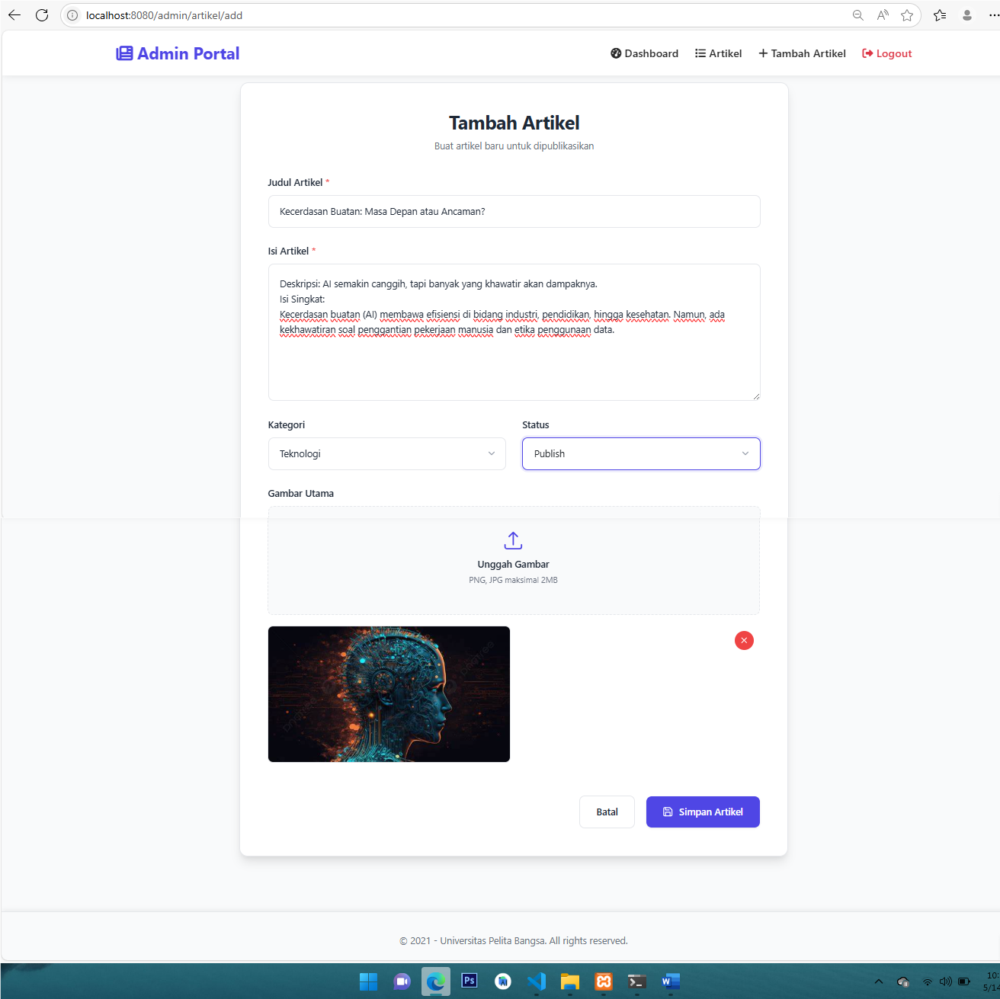

---

🖼️ _Screenshot Tampilan Edit Artikel dan Ubah Kategori:_

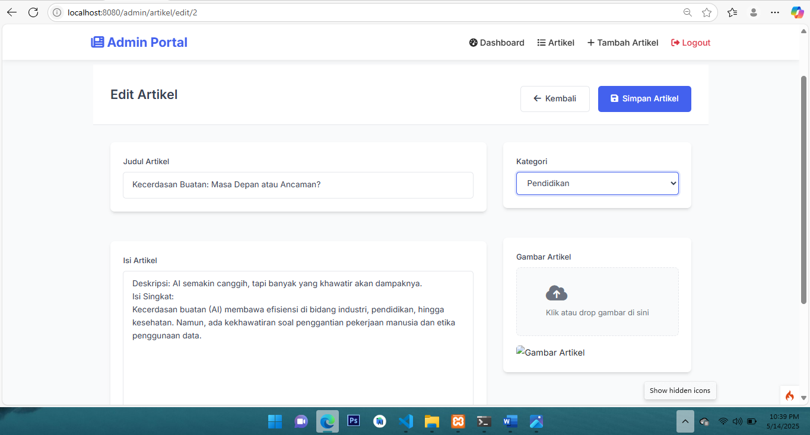

---

🖼️ _Screenshot Tampilan Setelah Edit Kategori:_

---

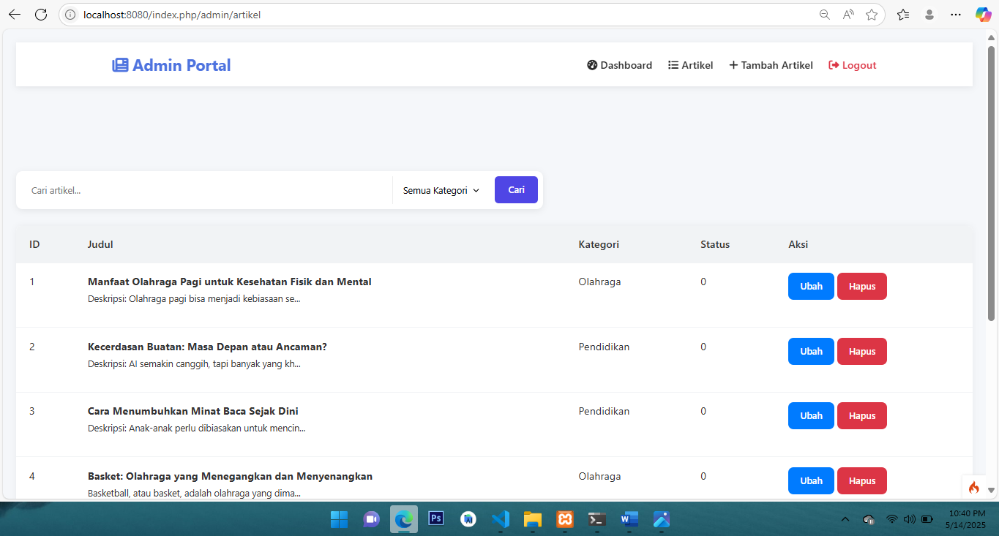

---

🖼️ _Screenshot Tampilan Hapus Artikel:_

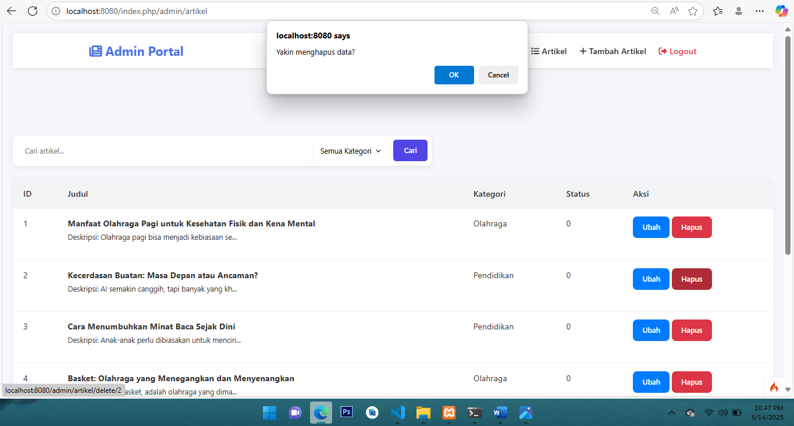

---

🖼️ _Screenshot Tampilan Setelah Hapus Artikel:_


---

# üìå Tugas

### 1. Modifikasi tampilan artikel/detail.php untuk menampilkan nama kategori artikel.

```php
<?= $this->include('template/header'); ?>

<div class="container">
  <article class="article">
    <div class="article-header">
      <h1 class="article-title"><?= esc($artikel['judul']); ?></h1>
      <div class="article-meta">
        <span class="category-badge">Kategori: <?= esc($artikel['nama_kategori']); ?></span>
      </div>
    </div>

    <div class="article-content">
      <div class="article-image-container">
        " alt="<?= esc($artikel['judul']); ?>"
          class="article-image">
      </div>

      <div class="article-text">
        <?= $artikel['isi']; ?>
      </div>
    </div>
  </article>
</div>

<?= $this->include('template/footer'); ?>
```

🖼️ _Screenshot Tampilan Artikel Detail dengan menampilkan Ketegori Artikel :_

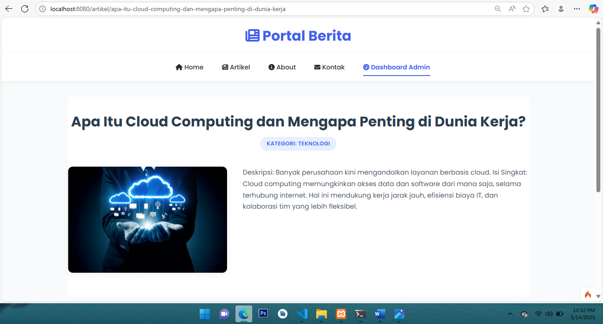

---

### 2. Tambahkan fitur menampilkan daftar kategori di halaman depan (opsional).

```php
<?= $this->include('template/header'); ?>

<div class="content-wrapper">
  <!-- Categories Section -->
  <aside class="categories-sidebar">
    <h3 class="sidebar-title">Explore Categories</h3>
    <ul class="category-list">
      <?php if ($kategori): foreach ($kategori as $cat): ?>
      <li
        class="category-item <?= (isset($current_category) && $current_category == $cat['id_kategori']) ? 'active' : '' ?>">
        <a href="<?= base_url('/kategori/' . $cat['id_kategori']); ?>" class="category-link">
          <?= $cat['nama_kategori']; ?>
        </a>
      </li>
      <?php endforeach; else: ?>
      <li class="category-item">No categories found</li>
      <?php endif; ?>
    </ul>
  </aside>

  <!-- Main Articles Grid -->
  <main class="articles-grid">
    <?php if ($artikel): foreach ($artikel as $row): ?>
    <article class="article-card">
      <div class="article-meta">
        <span
          class="article-category <?= (isset($current_category) && $current_category == $row['id_kategori']) ? 'active-category' : '' ?>">
          <?= $row['nama_kategori'] ?>
        </span>

        <time class="article-date"><?= date('M d, Y', strtotime($row['created_at'])); ?></time>
      </div>
      <div class="article-image-container">
        <a href="<?= base_url('/artikel/' . $row['slug']); ?>">
          " alt="<?= $row['judul']; ?>" class="article-image">
        </a>
      </div>
      <div class="article-content">
        <h2 class="article-title">
          <a href="<?= base_url('/artikel/' . $row['slug']); ?>"><?= $row['judul']; ?></a>
        </h2>
        <p class="article-excerpt"><?= substr($row['isi'], 0, 150); ?>...</p>
        <a href="<?= base_url('/artikel/' . $row['slug']); ?>" class="read-more-button">
          Read More <span class="arrow">‚Üí</span>
        </a>
      </div>
    </article>
    <?php endforeach; else: ?>
    <div class="no-articles">
      <h3>No articles found</h3>
      <p>Check back later for new content</p>
    </div>
    <?php endif; ?>
  </main>
</div>

<?= $this->include('template/footer'); ?>
```

🖼️ _Screenshot Tampilan Daftar Kategori Halaman Depan :_

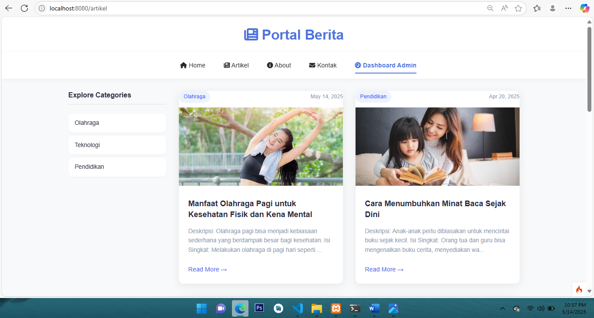

---

### 3. Buat fungsi untuk menampilkan artikel berdasarkan kategori tertentu (opsional).

```php
 public function kategori($id_kategori)
{
    $artikelModel = new \App\Models\ArtikelModel();
    $kategoriModel = new \App\Models\KategoriModel();

    $kategori = $kategoriModel->find($id_kategori);
    if (!$kategori) {
        throw \CodeIgniter\Exceptions\PageNotFoundException::forPageNotFound("Kategori tidak ditemukan");
    }

    $artikel = $artikelModel->getArtikelDenganKategori($id_kategori);

    $data = [
        'judul' => 'Kategori: ' . $kategori['nama_kategori'],
        'artikel' => $artikel,
        'kategori' => $kategoriModel->findAll(),
        'current_category' => $id_kategori // Tambahkan ini
    ];

    return view('artikel/index', $data);
}
```

🖼️ _Screenshot Tampilan Artikel Berdasarkan Kategori Olahraga :_

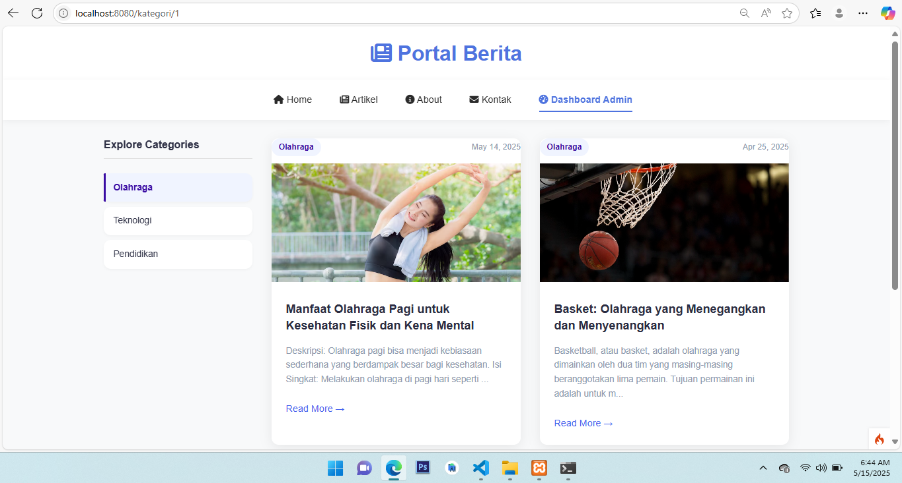

🖼️ _Screenshot Tampilan Artikel Berdasarkan Kategori Teknologi :_


🖼️ _Screenshot Tampilan Artikel Berdasarkan Kategori Pendidikan :_

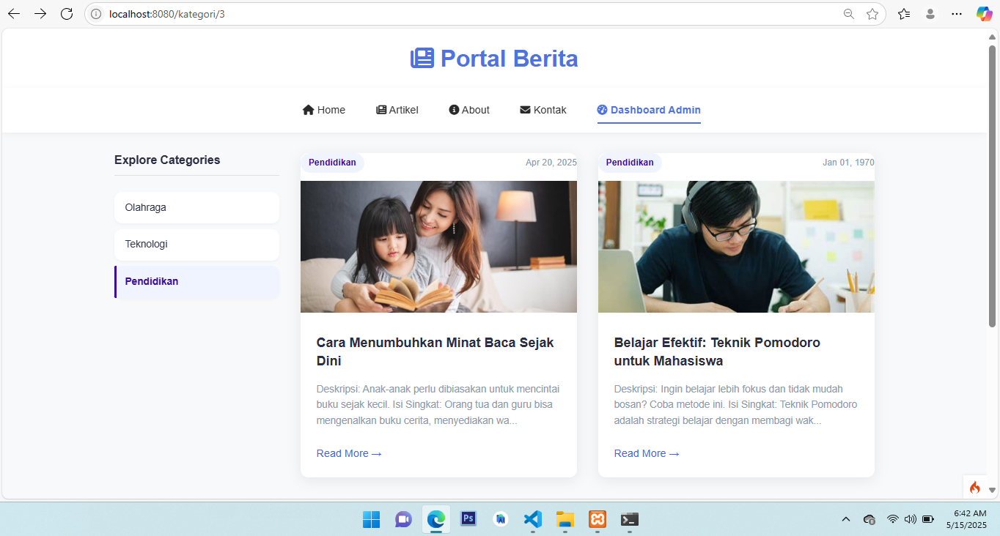

---

## ‚úÖ Kesimpulan

Melalui praktikum ini, saya berhasil memahami dan mengimplementasikan:

- Relasi antar tabel (khususnya One-to-Many) pada sistem database relasional.
- Penggunaan **Query Builder** untuk melakukan operasi join dan filtering data secara efisien.
- Integrasi antara **Model**, **Controller**, dan **View** dalam CodeIgniter untuk menampilkan data dari tabel yang berelasi.
- Pengelolaan dan tampilan artikel yang sudah terkategori dengan baik, termasuk fitur tambah, edit, hapus, dan filter artikel berdasarkan kategori.

Pemahaman dan penerapan konsep ini sangat penting dalam pengembangan aplikasi web yang skalabel dan terstruktur.

---

# Praktikum 8: AJAX

## üìå Tujuan

- Memahami konsep AJAX dan cara kerjanya.
- Mengimplementasikan AJAX pada aplikasi web dengan CodeIgniter 4.
- Melatih kemampuan problem solving dan debugging.

---

## üß© Langkah-langkah Praktikum

### 1. **Persiapan**

- Pastikan project `lab7_php_ci` dari praktikum sebelumnya sudah tersedia di dalam folder `htdocs`.
- Buka project menggunakan VS Code atau text editor lainnya.

---

### 2. **Menambahkan jQuery**

- Download jQuery dari: [https://jquery.com](https://jquery.com)
- Ekstrak dan salin `jquery-3.6.0.min.js` ke folder `public/assets/js/`

🖼️ _Screenshot Tampilan folder `public/assets/js/jquery-3.6.0.min.js` :_

## 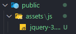

### 3. **Membuat Controller `AjaxController`**

Buat file baru di `app/Controllers/AjaxController.php`:

```php
<?php

namespace App\Controllers;

use CodeIgniter\Controller;
use App\Models\ArtikelModel;
use App\Models\KategoriModel;

class AjaxController extends Controller
{
    public function index()
    {
        return view('ajax/index');
    }

    public function getData()
    {
        $artikelModel = new ArtikelModel();
        $kategori = $this->request->getGet('kategori');
        $page = $this->request->getGet('page') ?? 1;
        $limit = 5;
        $offset = ($page - 1) * $limit;

        $builder = $artikelModel->select('artikel.*, kategori.nama_kategori')
            ->join('kategori', 'kategori.id_kategori = artikel.id_kategori');

        if (!empty($kategori)) {
            $builder->where('kategori.nama_kategori', $kategori);
        }

        $total = $builder->countAllResults(false);
        $data = $builder->findAll($limit, $offset);

        return $this->response->setJSON([
            'data' => $data,
            'totalPages' => ceil($total / $limit),
            'currentPage' => (int)$page
        ]);
    }

    public function save()
    {
        $artikelModel = new ArtikelModel();
        $kategoriModel = new KategoriModel();

        $namaKategori = $this->request->getPost('kategori');
        $kategori = $kategoriModel->where('nama_kategori', $namaKategori)->first();

        if (!$kategori) {
            return $this->response->setJSON(['status' => 'error', 'message' => 'Kategori tidak ditemukan']);
        }

        $data = [
            'judul' => $this->request->getPost('judul'),
            'isi' => $this->request->getPost('isi'),
            'id_kategori' => $kategori['id_kategori'],
            'status' => $this->request->getPost('status')
        ];

        $artikelModel->insert($data);

        return $this->response->setJSON(['status' => 'success']);
    }

    public function edit($id)
    {
        $artikelModel = new ArtikelModel();
        $kategoriModel = new KategoriModel();

        $namaKategori = $this->request->getPost('kategori');
        $kategori = $kategoriModel->where('nama_kategori', $namaKategori)->first();

        if (!$kategori) {
            return $this->response->setJSON(['status' => 'error', 'message' => 'Kategori tidak ditemukan']);
        }

        $data = [
            'judul' => $this->request->getPost('judul'),
            'isi' => $this->request->getPost('isi'),
            'id_kategori' => $kategori['id_kategori'],
            'status' => $this->request->getPost('status')
        ];

        $artikelModel->update($id, $data);

        return $this->response->setJSON(['status' => 'updated']);
    }

    public function delete($id)
    {
        $artikelModel = new ArtikelModel();
        $artikelModel->delete($id);

        return $this->response->setJSON(['status' => 'deleted']);
    }
}
```

---

### 4. Membuat View ajax/index.php

Buat file baru di `app/Views/ajax/index.php`:

```php
<?= $this->include('template/header'); ?>

<h1>Data Artikel</h1>
<table class="table-data" id="artikelTable">
    <thead>
        <tr>
            <th>ID</th>
            <th>Judul</th>
            <th>Status</th>
            <th>Aksi</th>
        </tr>
    </thead>
    <tbody></tbody>
</table>

<script src="<?= base_url('assets/js/jquery-3.6.0.min.js') ?>"></script>
<script>
$(document).ready(function() {
    function showLoadingMessage() {
        $('#artikelTable tbody').html('<tr><td colspan="4">Loading data...</td></tr>');
    }

    function loadData() {
        showLoadingMessage();
        $.ajax({
            url: "<?= base_url('ajax/getData') ?>",
            method: "GET",
            dataType: "json",
            success: function(data) {
                var tableBody = "";
                data.forEach(function(row) {
                    tableBody += '<tr>';
                    tableBody += '<td>' + row.id + '</td>';
                    tableBody += '<td>' + row.judul + '</td>';
                    tableBody += '<td><span class="status">---</span></td>';
                    tableBody += '<td>';
                    tableBody += '<a href="<?= base_url('artikel/edit/') ?>' + row.id + '" class="btn btn-primary">Edit</a> ';
                    tableBody += '<a href="#" class="btn btn-danger btn-delete" data-id="' + row.id + '">Delete</a>';
                    tableBody += '</td></tr>';
                });
                $('#artikelTable tbody').html(tableBody);
            }
        });
    }

    loadData();

    $(document).on('click', '.btn-delete', function(e) {
        e.preventDefault();
        var id = $(this).data('id');
        if (confirm('Apakah Anda yakin ingin menghapus artikel ini?')) {
            $.ajax({
                url: "<?= base_url('artikel/delete/') ?>" + id,
                method: "DELETE",
                success: function() {
                    loadData();
                },
                error: function(jqXHR, textStatus, errorThrown) {
                    alert('Error deleting article: ' + textStatus + " " + errorThrown);
                }
            });
        }
    });
});
</script>

<?= $this->include('template/footer'); ?>
```

---

### 5. Sesuaikan route di `app/Config/Routes.php`:

```php
$routes->get('ajax', 'AjaxController::index');
$routes->get('ajax/create', 'AjaxController::create');
$routes->get('ajax/getData', 'AjaxController::getData');
$routes->post('ajax/add', 'AjaxController::add');
$routes->post('ajax/save', 'AjaxController::save');
$routes->post('ajax/edit/(:num)', 'AjaxController::edit/$1');
$routes->delete('ajax/delete/(:num)', 'AjaxController::delete/$1');
```

# üìå Tugas

Selesaikan programnya sesuai Langkah-langkah yang ada. Tambahkan fungsi untuk
tambah dan ubah data. Anda boleh melakukan improvisasi.

### 1. Tampilan awal:

Menampilkan data artikel dalam tabel secara otomatis dengan AJAX.

## 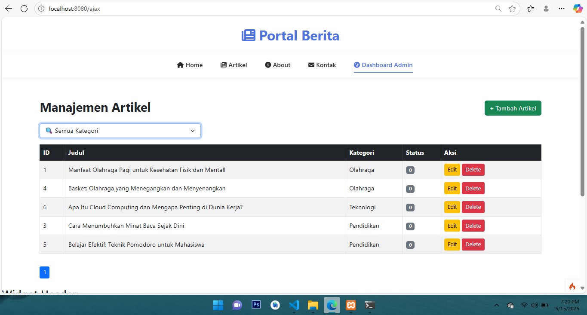

### 2. Tambah Artikel:

Menekan tombol “Tambah Data” akan menampilkan form input.

## 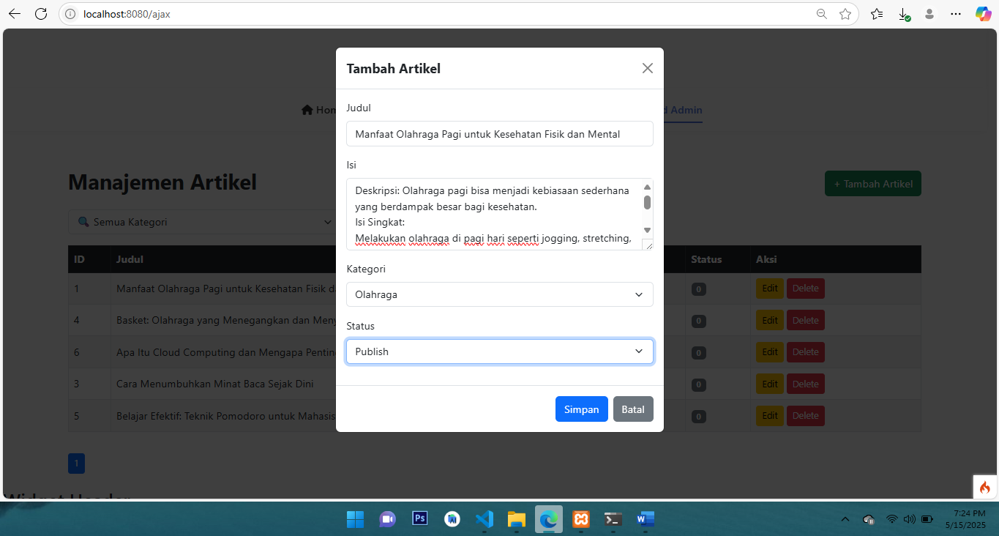

### 3. Edit Artikel:

Tombol edit menampilkan data di form dan bisa diubah.

## 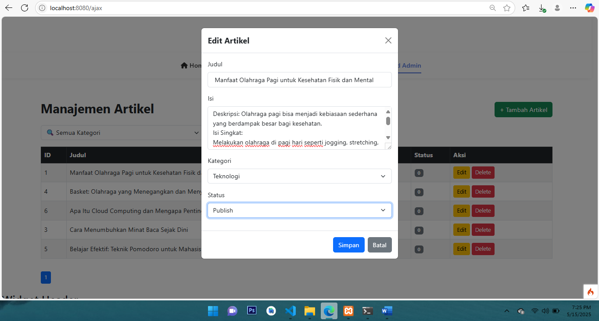

### 4. Delete Artikel:

Menghapus artikel menggunakan tombol delete dengan konfirmasi.

## 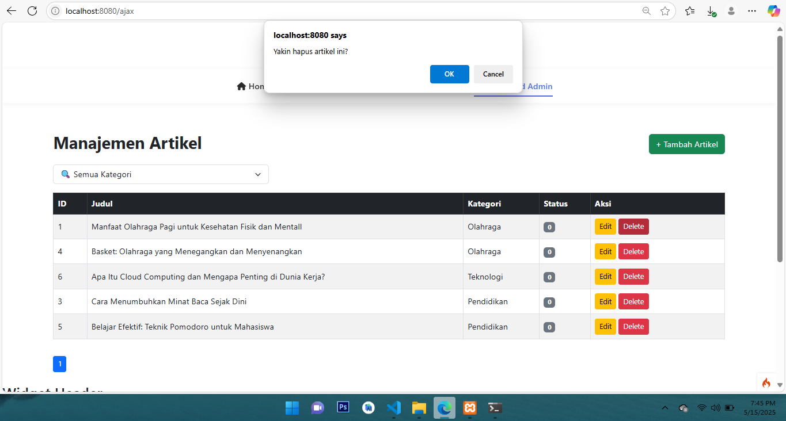

---

## ‚úÖ Kesimpulan

- AJAX memberikan pengalaman pengguna yang lebih baik dengan cara memperbarui bagian tertentu dari halaman tanpa reload penuh.

- jQuery sangat membantu dalam menulis kode AJAX secara ringkas dan mudah dipahami.

- Dengan memanfaatkan AJAX di CodeIgniter 4, proses pengelolaan data menjadi lebih efisien dan interaktif.

- Praktikum ini juga melatih kemampuan debugging dan pengorganisasian file dalam proyek MVC (Model-View-Controller).

---

# Praktikum 9 - Implementasi AJAX Pagination dan Search

## üìå Deskripsi

Praktikum ini bertujuan untuk mengimplementasikan fitur **pencarian (search)** dan **pagination (halaman)** pada data artikel menggunakan teknik **AJAX** di dalam framework **CodeIgniter 4**. Dengan teknik ini, data akan diambil dari server tanpa harus me-refresh halaman, sehingga dapat meningkatkan **User Experience (UX)** aplikasi web.

---

## 🎯 Tujuan

1. Memahami konsep dasar penggunaan AJAX dalam pagination dan search.
2. Mengimplementasikan fitur pagination dan search dengan AJAX di CodeIgniter 4.
3. Meningkatkan performa dan kenyamanan pengguna aplikasi web (UX).

---

## 🛠️ Tools dan Persiapan

- **Text Editor**: VSCode
- **Database**: MySQL Server (gunakan database `lab_ci4`)
- **Framework**: CodeIgniter 4
- **Library**: jQuery (via CDN)

---

## 📂 Struktur Folder

Pastikan folder `lab7_php_ci` sudah tersedia dan digunakan sebagai dasar praktikum ini.

---

## üöÄ Langkah-langkah Praktikum

### 1. Persiapan Awal

- Pastikan MySQL Server berjalan.
- Database `lab_ci4` aktif dan memiliki tabel:
  - `artikel`
  - `kategori`
- jQuery tersedia (gunakan CDN: `https://code.jquery.com/jquery-3.7.1.min.js`)

---

### 2. Modifikasi Controller `Artikel.php`

Edit method `admin_index()` agar:

- Memfilter data berdasarkan **keyword** (`q`) dan **kategori**
- Menggunakan `paginate()` untuk membagi halaman
- Jika request adalah AJAX, kembalikan data dalam bentuk JSON

```php
public function admin_index()
{
    $title = 'Daftar Artikel';
    $q = $this->request->getVar('q') ?? '';
    $kategoriId = $this->request->getVar('kategori');
    $sort = $this->request->getVar('sort');

    $model = new ArtikelModel();
    $model->select('artikel.*, kategori.nama_kategori')
          ->join('kategori', 'kategori.id_kategori = artikel.id_kategori', 'left');

    if (!empty($q)) {
        $model->like('judul', $q)->orLike('isi', $q);
    }

    if (!empty($kategoriId)) {
        $model->where('artikel.id_kategori', $kategoriId);
    }

    // Sorting
    if ($sort == 'judul_asc') {
        $model->orderBy('judul', 'ASC');
    } elseif ($sort == 'judul_desc') {
        $model->orderBy('judul', 'DESC');
    }

    // AJAX: kembalikan dalam format JSON
   if ($this->request->isAJAX()) {
    $perPage = 5;
    $page = (int) $this->request->getVar('page') ?? 1;

    $artikel = $model->paginate($perPage, 'default', $page);
    $pager = $model->pager;

    return $this->response->setJSON([
        'success' => true,
        'artikel' => $artikel,
        'pagination' => $pager->makeLinks($page, $perPage, $model->pager->getTotal(), 'default_full')
    ]);
}
```

---

### 3. Modifikasi View admin_index.php

- Tambahkan form pencarian dan filter kategori.

- Hapus render HTML tabel statis.

- Tambahkan elemen kosong untuk menampung hasil AJAX.

- Gunakan jQuery untuk fetch data dan render ke halaman.
  **Struktur Elemen HTML:**

```js
<?= $this->include('template/admin_header'); ?>
<form id="filterForm" method="get" class="form-search">
  <input type="text" name="q" id="q" placeholder="Cari artikel...">

  <select name="kategori" id="kategori">
    <option value="">Semua Kategori</option>
    <?php foreach ($kategori as $cat): ?>
    <option value="<?= $cat['id_kategori']; ?>">
      <?= esc($cat['nama_kategori']); ?>
    </option>
    <?php endforeach; ?>
  </select>

  <select name="sort" id="sort">
    <option value="">Urutkan</option>
    <option value="judul_asc">Judul A-Z</option>
    <option value="judul_desc">Judul Z-A</option>
  </select>

  <button type="submit" class="btn">Cari</button>
</form>

<!-- Loading Indicator -->
<div id="loading" class="loading-wrapper">
  <!-- From Uiverse.io by gustavofusco -->
  <svg xmlns="http://www.w3.org/2000/svg" height="200px" width="200px" viewBox="0 0 200 200" class="pencil">
    <defs>
      <clipPath id="pencil-eraser">
        <rect height="30" width="30" ry="5" rx="5"></rect>
      </clipPath>
    </defs>
    <circle transform="rotate(-113,100,100)" stroke-linecap="round" stroke-dashoffset="439.82"
      stroke-dasharray="439.82 439.82" stroke-width="2" stroke="currentColor" fill="none" r="70" class="pencil__stroke">
    </circle>
    <g transform="translate(100,100)" class="pencil__rotate">
      <g fill="none">
        <circle transform="rotate(-90)" stroke-dashoffset="402" stroke-dasharray="402.12 402.12" stroke-width="30"
          stroke="hsl(223,90%,50%)" r="64" class="pencil__body1"></circle>
        <circle transform="rotate(-90)" stroke-dashoffset="465" stroke-dasharray="464.96 464.96" stroke-width="10"
          stroke="hsl(223,90%,60%)" r="74" class="pencil__body2"></circle>
        <circle transform="rotate(-90)" stroke-dashoffset="339" stroke-dasharray="339.29 339.29" stroke-width="10"
          stroke="hsl(223,90%,40%)" r="54" class="pencil__body3"></circle>
      </g>
      <g transform="rotate(-90) translate(49,0)" class="pencil__eraser">
        <g class="pencil__eraser-skew">
          <rect height="30" width="30" ry="5" rx="5" fill="hsl(223,90%,70%)"></rect>
          <rect clip-path="url(#pencil-eraser)" height="30" width="5" fill="hsl(223,90%,60%)"></rect>
          <rect height="20" width="30" fill="hsl(223,10%,90%)"></rect>
          <rect height="20" width="15" fill="hsl(223,10%,70%)"></rect>
          <rect height="20" width="5" fill="hsl(223,10%,80%)"></rect>
          <rect height="2" width="30" y="6" fill="hsla(223,10%,10%,0.2)"></rect>
          <rect height="2" width="30" y="13" fill="hsla(223,10%,10%,0.2)"></rect>
        </g>
      </g>
      <g transform="rotate(-90) translate(49,-30)" class="pencil__point">
        <polygon points="15 0,30 30,0 30" fill="hsl(33,90%,70%)"></polygon>
        <polygon points="15 0,6 30,0 30" fill="hsl(33,90%,50%)"></polygon>
        <polygon points="15 0,20 10,10 10" fill="hsl(223,10%,10%)"></polygon>
      </g>
    </g>
  </svg>
</div>


<!-- Container untuk artikel -->
<div id="artikelTableContainer"></div>

<!-- jQuery -->
<script src="https://code.jquery.com/jquery-3.7.1.min.js"></script>

<script>
function loadArtikel(page = 1) {
  $('#loading').show();
  const q = $('#q').val();
  const kategori = $('#kategori').val();
  const sort = $('#sort').val();

  const startTime = new Date().getTime(); // waktu mulai

  $.ajax({
    url: `<?= base_url('admin/artikel') ?>?page=${page}`,
    type: 'GET',
    dataType: 'json',
    data: {
      q,
      kategori,
      sort
    },
    success: function(response) {
      const endTime = new Date().getTime();
      const elapsed = endTime - startTime;
      const delay = Math.max(1000 - elapsed, 0); // sisa waktu agar total tetap 5 detik

      setTimeout(() => {
        $('#loading').hide();

        if (response.success) {
          let html = `<table class="table">
              <thead>
                <tr>
                  <th>ID</th>
                  <th>Judul</th>
                  <th>Kategori</th>
                  <th>Status</th>
                  <th>Aksi</th>
                </tr>
              </thead>
              <tbody>`;

          if (response.artikel.length > 0) {
            response.artikel.forEach(row => {
              html += `<tr>
                  <td>${row.id}</td>
                  <td><b>${row.judul}</b><p><small>${row.isi.substring(0, 50)}...</small></p></td>
                  <td>${row.nama_kategori ?? 'Tidak ada'}</td>
                  <td>${row.status}</td>
                  <td>
                    <a class="btn btn-primary" href="/admin/artikel/edit/${row.id}">Ubah</a>
                    <a class="btn btn-danger" href="/admin/artikel/delete/${row.id}" onclick="return confirm('Yakin menghapus data?');">Hapus</a>
                  </td>
                </tr>`;
            });
          } else {
            html += `<tr><td colspan="5">Belum ada data.</td></tr>`;
          }

          html += `</tbody></table><div class="pagination">${response.pagination}</div>`;
          $('#artikelTableContainer').html(html);
        }
      }, delay);
    },
    error: function(xhr, status, error) {
      const endTime = new Date().getTime();
      const elapsed = endTime - startTime;
      const delay = Math.max(1000 - elapsed, 0);

      setTimeout(() => {
        $('#loading').hide();
        $('#artikelTableContainer').html('<p>Terjadi kesalahan saat memuat data.</p>');
      }, delay);
    }
  });
}


// Trigger pertama kali
$(document).ready(function() {
  loadArtikel();

  $('#filterForm').on('submit', function(e) {
    e.preventDefault();
    loadArtikel();
  });

  // Untuk pagination dinamis
  $(document).on('click', '.pagination a', function(e) {
    e.preventDefault();
    const href = $(this).attr('href');
    const urlParams = new URLSearchParams(href.split('?')[1]);
    const page = urlParams.get('page') ?? 1;

    loadArtikel(page);
  });

});
</script>

<?= $this->include('template/admin_footer'); ?>
```

### ‚úÖ Fitur Tambahan (Opsional)

- Tambahkan indikator loading saat mengambil data.

- Tambahkan fitur sorting berdasarkan judul/artikel menggunakan parameter sort=judul_asc|judul_desc dalam URL AJAX.

### üß™ Pengujian dan Screenshot

**Buka halaman admin artikel**

🖼️ _Screenshot hasil Admin Artikel:_

## 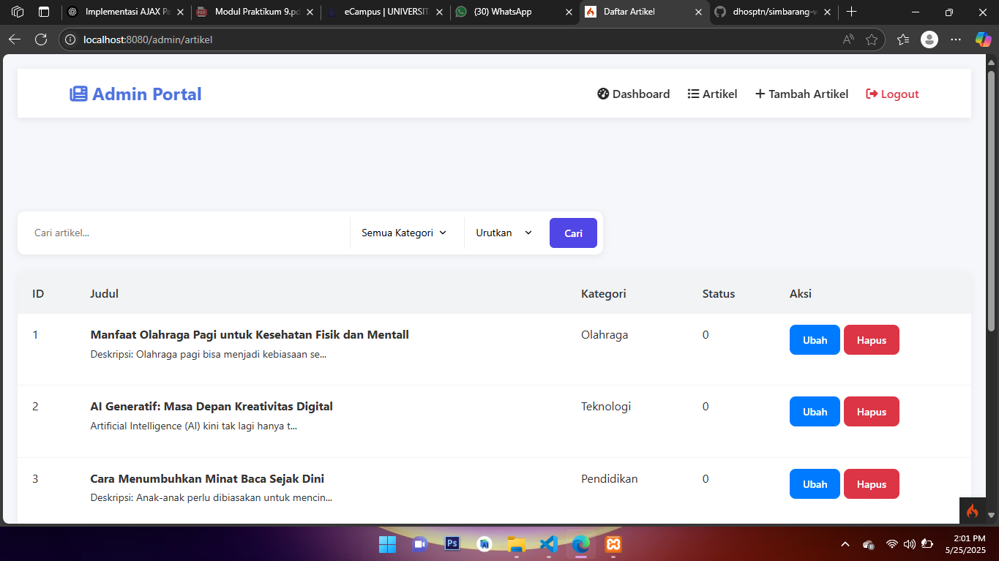

**Coba cari berdasarkan judul**

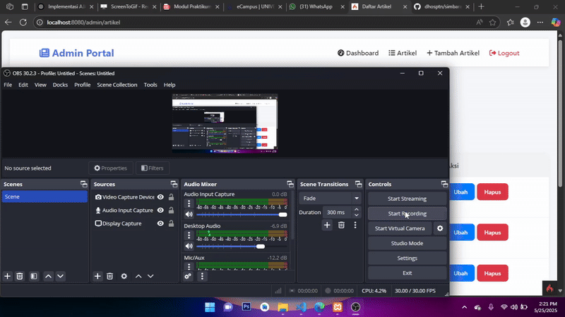

---

**Coba fitur sorting (mengurutkan artikel berdasarkan kategori, urutkan A-Z.)**
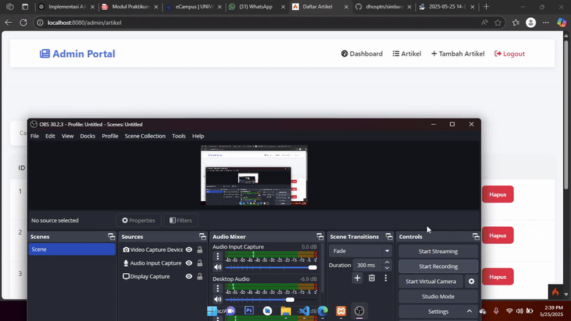

---

**Coba klik pagination**
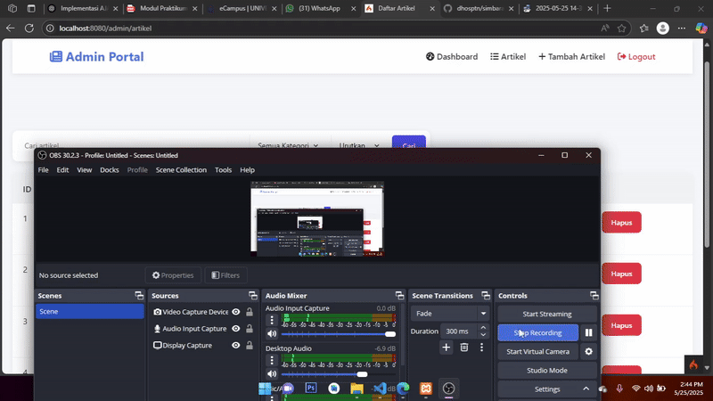

---

### üìù Kesimpulan

- Kita telah memanfaatkan AJAX untuk mengambil data artikel secara dinamis.

- Fitur pagination dan search menjadi lebih responsif karena tidak perlu reload halaman.

- Implementasi ini meningkatkan UX dan performa aplikasi web.

- Teknik ini penting dalam pengembangan aplikasi modern berbasis web.

---

# Praktikum 10 - REST API dengan CodeIgniter 4

## üìå Deskripsi

Praktikum ini membahas penerapan konsep REST API menggunakan framework CodeIgniter 4. REST API memungkinkan backend dan frontend dapat berkomunikasi dengan protokol HTTP (GET, POST, PUT, DELETE), serta memudahkan integrasi antar platform.

---

## 🎯 Tujuan Praktikum

- Memahami konsep dasar **API (Application Programming Interface)**.
- Memahami prinsip kerja **RESTful API**.
- Menerapkan **CRUD (Create, Read, Update, Delete)** menggunakan REST API di CodeIgniter.
- Menguji endpoint API dengan aplikasi **Postman**.

---

## üìñ Apa itu REST API?

REST API (Representational State Transfer) adalah standar arsitektur untuk membuat web service yang bersifat ringan, cepat, dan mudah diakses oleh berbagai platform.

### Analogi REST API:

REST API seperti daftar menu restoran. Pelanggan (client) hanya bisa memesan berdasarkan menu yang tersedia, meskipun koki (server) sebenarnya bisa membuat lebih banyak jenis makanan. Tujuannya adalah membatasi akses terhadap sumber daya agar tetap aman dan terstruktur.

---

## 🛠️ Langkah-langkah Praktikum

### 1. Persiapan Awal

- Pastikan folder `lab7_php_ci` sudah ada di dalam `htdocs`.
- Install aplikasi Postman dari: [https://www.postman.com/downloads/](https://www.postman.com/downloads/)


---

### 2. Membuat REST Controller

Buat file `Post.php` pada direktori `app/Controllers`, lalu tambahkan kode berikut:

```php
namespace App\Controllers;

use CodeIgniter\RESTful\ResourceController;
use App\Models\ArtikelModel;

class Post extends ResourceController
{
    use \CodeIgniter\API\ResponseTrait;

    public function index()
    {
        $model = new ArtikelModel();
        $data['artikel'] = $model->orderBy('id', 'DESC')->findAll();
        return $this->respond($data);
    }

    public function create()
    {
        $model = new ArtikelModel();
        $data = [
            'judul' => $this->request->getVar('judul'),
            'isi'   => $this->request->getVar('isi')
        ];
        $model->insert($data);
        return $this->respondCreated(['message' => 'Data berhasil ditambahkan']);
    }

    public function show($id = null)
    {
        $model = new ArtikelModel();
        $data = $model->where('id', $id)->first();
        return $data ? $this->respond($data) : $this->failNotFound('Data tidak ditemukan');
    }

    public function update($id = null)
    {
        $model = new ArtikelModel();
        $data = [
            'judul' => $this->request->getVar('judul'),
            'isi'   => $this->request->getVar('isi')
        ];
        $model->update($id, $data);
        return $this->respond(['message' => 'Data berhasil diupdate']);
    }

    public function delete($id = null)
    {
        $model = new ArtikelModel();
        $model->delete($id);
        return $this->respondDeleted(['message' => 'Data berhasil dihapus']);
    }
}
```

---

#### 3. Menambahkan Routing API

Edit file app/Config/Routes.php, tambahkan:

```php
$routes->resource('post');
```

Kemudian cek dengan perintah:

```bash
php spark routes
```

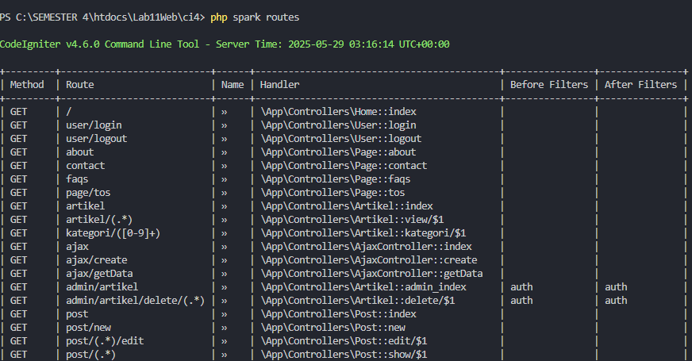

---

### 4. Testing REST API CodeIgniter

Buka aplikasi postman dan pilih create new ‚Üí HTTP Request

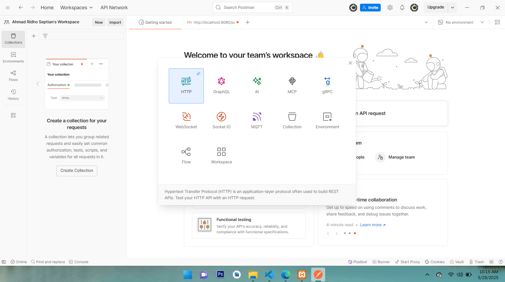

---

### 5. Pengujian API Menggunakan Postman

#### **a. Menampilkan Semua Data Method: GET**

URL: http://localhost:8080/post

üì∏ Screenshot:

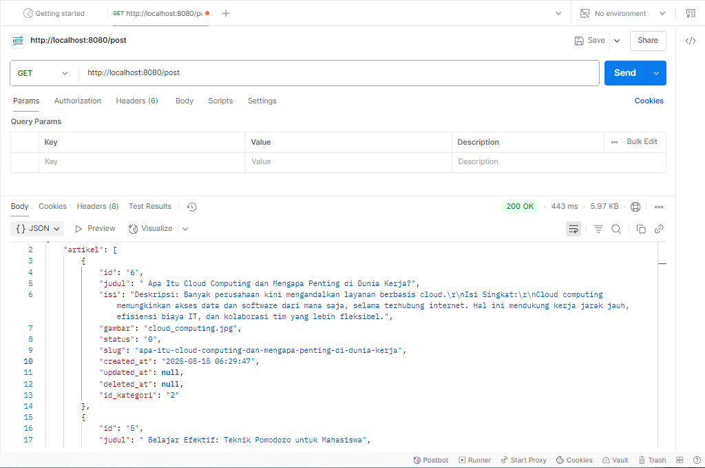

---

#### **b. Menampilkan Data Spesifik**

Method: GET

URL: http://localhost:8080/post/1

üì∏ Screenshot:

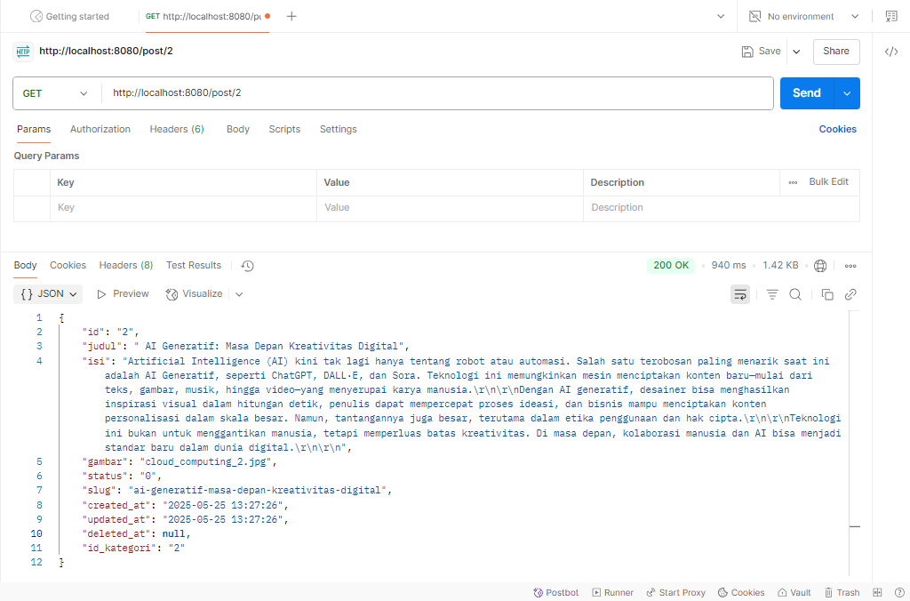

---

#### **c. Menambahkan Data**

Method: POST

URL: http://localhost:8080/post

Body: x-www-form-urlencoded

judul: Judul Artikel 7

isi: Isi Artikel ke 7 ditambah melalui API by Ardho

üì∏ Screenshot:

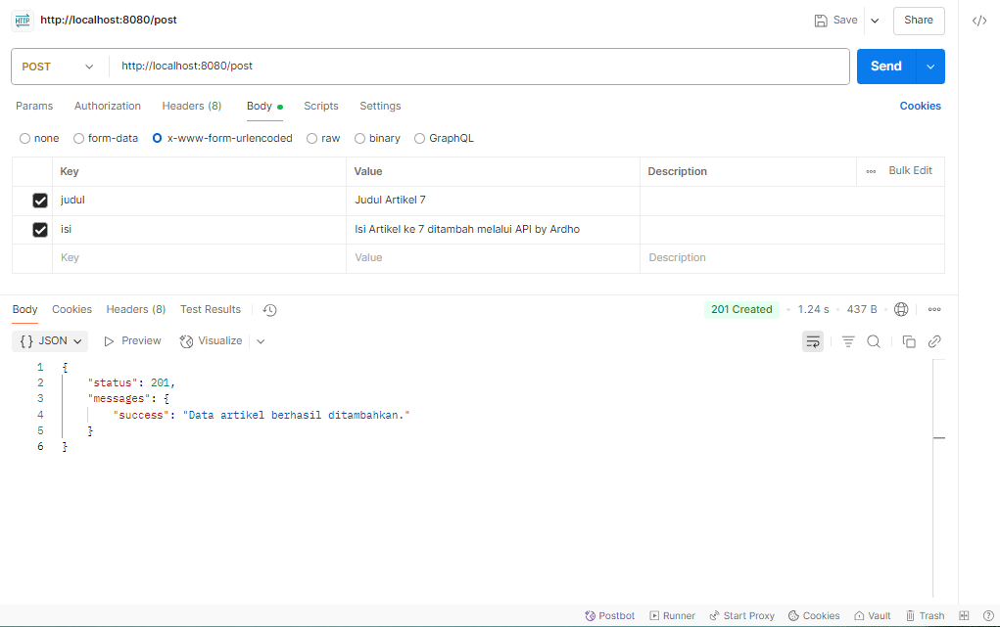

---

#### **d. Mengubah Data**

Method: PUT

URL: http://localhost:8080/post/1

Body: x-www-form-urlencoded

judul: Judul Artikel 2 diubah

isi: Isi Artikel ke 2 diubah melalui API by Ardho

üì∏ Screenshot:

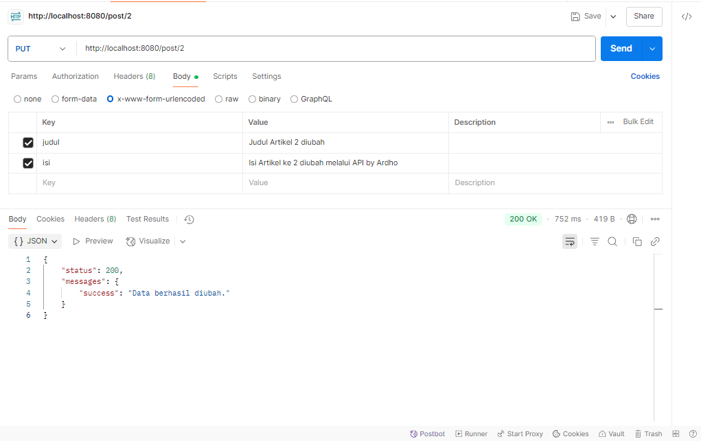

---

### **e. Menghapus Data**

Method: DELETE

URL: http://localhost:8080/post/1

üì∏ Screenshot:

## 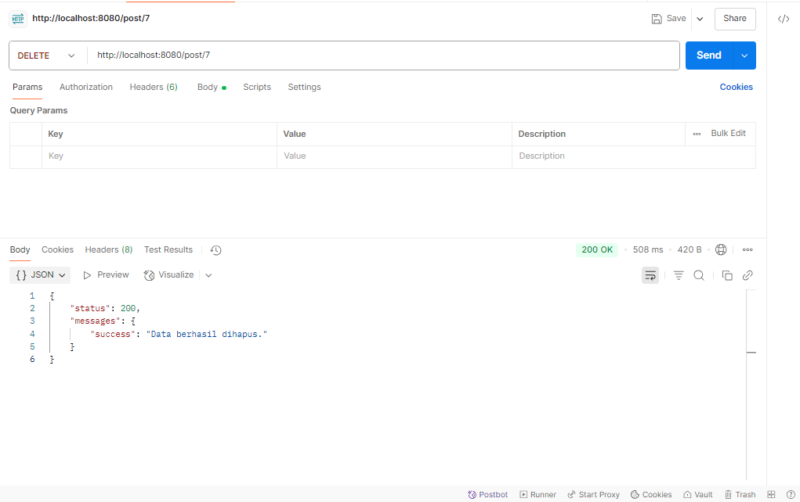

---

### üìå Penjelasan Fungsi Method pada REST Controller

| Method     | Fungsi                                       |
| ---------- | -------------------------------------------- |
| `index()`  | Menampilkan semua data artikel               |
| `show()`   | Menampilkan satu data artikel berdasarkan ID |
| `create()` | Menambahkan data baru                        |
| `update()` | Mengubah data yang ada                       |
| `delete()` | Menghapus data berdasarkan ID                |

---

## ‚úÖ Kesimpulan

Pada praktikum ini kita telah mempelajari:

- ‚úÖ Konsep dasar REST API dan penggunaannya dalam pengembangan web modern.

- ‚úÖ Cara membangun REST API menggunakan CodeIgniter 4.

- ‚úÖ Implementasi operasi CRUD melalui endpoint HTTP: GET, POST, PUT, DELETE.

- ‚úÖ Pengujian endpoint API menggunakan Postman.

Dengan REST API, pengembangan aplikasi menjadi lebih modular, efisien, dan fleksibel, sehingga dapat dengan mudah diintegrasikan dengan berbagai frontend seperti Vue, React, bahkan aplikasi mobile Android/iOS.

---

# Praktikum 11: VueJS dan Frontend API

### Tujuan

1. Memahami konsep dasar API.
2. Memahami konsep dasar framework VueJS.
3. Membuat frontend API menggunakan framework VueJS 3.

---

# Persiapan Awal

### 1. Alat dan Bahan

- **Text Editor**: Disarankan menggunakan [Visual Studio Code](https://code.visualstudio.com/).
- **Browser**: Chrome/Firefox.
- **Webserver**: XAMPP atau sejenisnya.
- **API Backend**: Aplikasi REST API berjalan di `http://localhost/labci4/public`.

### 2. Buat Folder Project

Buat folder dengan nama `lab8_vuejs` di dalam folder `htdocs` atau `www`.

### 3. Struktur Direktori

Buat struktur direktori dan file berikut:

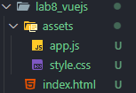

---

## Langkah-Langkah Praktikum

### 1. Tambahkan Library di `index.html`

Masukkan VueJS dan Axios melalui CDN di dalam `<head>`:

```html
<script src="https://unpkg.com/vue@3/dist/vue.global.js"></script>
<script src="https://unpkg.com/axios/dist/axios.min.js"></script>
```

---

### 2. Membuat Tampilan Utama (index.html)

Gunakan template berikut:

```html
<!DOCTYPE html>
<html lang="en">
  <head>
    <meta charset="UTF-8" />
    <meta name="viewport" content="width=device-width, initial-scale=1.0" />
    <title>Artikel Management</title>
    <script src="https://unpkg.com/vue@3/dist/vue.global.js"></script>
    <script src="https://unpkg.com/axios/dist/axios.min.js"></script>
    <link
      rel="stylesheet"
      href="https://cdnjs.cloudflare.com/ajax/libs/font-awesome/6.4.0/css/all.min.css"
    />
    <link
      href="https://fonts.googleapis.com/css2?family=Inter:wght@300;400;500;600;700&display=swap"
      rel="stylesheet"
    />
    <link rel="stylesheet" href="assets/style.css" />
  </head>
  <body>
    <div id="app">
      <button id="btn-tambah" @click="tambah">
        <i class="fas fa-plus"></i> Tambah Artikel
      </button>

      <div class="modal" v-if="showForm">
        <div class="modal-content">
          <span class="close" @click="showForm = false">&times;</span>
          <form id="form-data" @submit.prevent="saveData">
            <h3 id="form-title">
              <i :class="formData.id ? 'fas fa-edit' : 'fas fa-plus'"></i>
              {{ formTitle }}
            </h3>
            <div>
              <input
                type="text"
                v-model="formData.judul"
                placeholder="Judul Artikel"
                required
              />
            </div>
            <div>
              <textarea
                v-model="formData.isi"
                rows="10"
                placeholder="Isi artikel..."
              ></textarea>
            </div>
            <div>
              <select v-model.number="formData.status">
                <option v-for="option in statusOptions" :value="option.value">
                  {{ option.text }}
                </option>
              </select>
            </div>
            <input type="hidden" v-model="formData.id" />
            <button type="submit" id="btnSimpan">
              <i class="fas fa-save"></i> Simpan
            </button>
            <button type="button" @click="showForm = false">
              <i class="fas fa-times"></i> Batal
            </button>
          </form>
        </div>
      </div>

      <h1><i class="fas fa-newspaper"></i> Daftar Artikel</h1>

      <table>
        <thead>
          <tr>
            <th>ID</th>
            <th>Judul</th>
            <th>Status</th>
            <th>Aksi</th>
          </tr>
        </thead>
        <tbody>
          <tr v-for="(row, index) in artikel" :key="row.id">
            <td class="center-text">{{ row.id }}</td>
            <td>{{ row.judul }}</td>
            <td>
              <span :class="'status-badge status-' + statusClass(row.status)">
                {{ statusText(row.status) }}
              </span>
            </td>
            <td class="center-text">
              <a href="#" @click="edit(row)" class="action-link edit-link">
                <i class="fas fa-edit"></i> Edit
              </a>
              <a
                href="#"
                @click="hapus(index, row.id)"
                class="action-link delete-link"
              >
                <i class="fas fa-trash-alt"></i> Hapus
              </a>
            </td>
          </tr>
          <tr v-if="artikel.length === 0">
            <td colspan="4" class="empty-state">
              <i
                class="fas fa-inbox"
                style="font-size: 2rem; margin-bottom: 1rem"
              ></i>
              <p>Tidak ada artikel yang tersedia.</p>
            </td>
          </tr>
        </tbody>
      </table>
    </div>
    <script src="assets/app.js"></script>
  </body>
</html>
```

---

### 3. Menambahkan Logika VueJS di app.js

```js
const { createApp } = Vue;

const apiUrl = 'http://localhost/labci4/public';

createApp({
  data() {
    return {
      artikel: [],
      formData: {
        id: null,
        judul: '',
        isi: '',
        status: 0,
      },
      showForm: false,
      formTitle: 'Tambah Data',
      statusOptions: [
        { text: 'Draft', value: 0 },
        { text: 'Publish', value: 1 },
      ],
    };
  },
  mounted() {
    this.loadData();
  },
  methods: {
    loadData() {
      axios
        .get(apiUrl + '/post')
        .then((response) => {
          this.artikel = response.data.artikel.map((item) => ({
            ...item,
            status: Number(item.status),
          }));
        })
        .catch((error) => console.error('Error:', error));
    },
    tambah() {
      this.showForm = true;
      this.formTitle = 'Tambah Data';
      this.formData = {
        id: null,
        judul: '',
        isi: '',
        status: 0,
      };
    },
    edit(data) {
      this.showForm = true;
      this.formTitle = 'Ubah Data';
      this.formData = {
        id: data.id,
        judul: data.judul,
        isi: data.isi,
        status: Number(data.status),
      };
    },
    hapus(index, id) {
      if (confirm('Yakin menghapus data?')) {
        axios
          .delete(apiUrl + '/post/' + id)
          .then(() => {
            this.artikel.splice(index, 1);
          })
          .catch((error) => console.error('Error:', error));
      }
    },
    saveData() {
      this.formData.status = Number(this.formData.status);

      const request = this.formData.id
        ? axios.put(apiUrl + '/post/' + this.formData.id, this.formData)
        : axios.post(apiUrl + '/post', this.formData);

      request
        .then((response) => {
          if (this.formData.id) {
            const index = this.artikel.findIndex(
              (item) => item.id === this.formData.id
            );
            if (index !== -1) {
              this.artikel[index] = { ...this.formData };
            }
          } else {
            this.loadData();
          }
        })
        .catch((error) => {
          console.error('Error:', error.response?.data || error.message);
          alert('Error: ' + (error.response?.data?.message || error.message));
        })
        .finally(() => {
          this.showForm = false;
        });
    },
    statusText(status) {
      const numStatus = Number(status);
      return numStatus === 1 ? 'Publish' : 'Draft';
    },
    statusClass(status) {
      return Number(status);
    },
  },
}).mount('#app');
```

---

### 4. Tambahkan CSS (style.css)

```css
:root {
  --primary: #4361ee;
  --primary-light: #e0e7ff;
  --danger: #ef4444;
  --danger-light: #fee2e2;
  --success: #10b981;
  --success-light: #d1fae5;
  --warning: #f59e0b;
  --warning-light: #fef3c7;
  --dark: #1e293b;
  --light: #f8fafc;
  --gray: #94a3b8;
  --gray-light: #e2e8f0;
}

* {
  margin: 0;
  padding: 0;
  box-sizing: border-box;
}

body {
  font-family: 'Inter', sans-serif;
  background-color: #f1f5f9;
  color: var(--dark);
  line-height: 1.6;
}

#app {
  max-width: 1200px;
  margin: 0 auto;
  padding: 2rem;
}

h1 {
  font-size: 2rem;
  font-weight: 600;
  margin-bottom: 1.5rem;
  color: var(--dark);
}

/* Button Styles */
button {
  cursor: pointer;
  transition: all 0.2s ease;
  border: none;
  border-radius: 0.375rem;
  font-weight: 500;
  padding: 0.5rem 1rem;
  display: inline-flex;
  align-items: center;
  gap: 0.5rem;
}

#btn-tambah {
  background-color: var(--primary);
  color: white;
  margin-bottom: 1.5rem;
}

#btn-tambah:hover {
  background-color: #3a56d4;
}

#btn-tambah i {
  font-size: 0.9rem;
}

/* Modal Styles */
.modal {
  position: fixed;
  top: 0;
  left: 0;
  width: 100%;
  height: 100%;
  background-color: rgba(0, 0, 0, 0.5);
  display: flex;
  justify-content: center;
  align-items: center;
  z-index: 1000;
}

.modal-content {
  background-color: white;
  padding: 2rem;
  border-radius: 0.5rem;
  width: 100%;
  max-width: 600px;
  box-shadow: 0 10px 25px -5px rgba(0, 0, 0, 0.1);
}

.close {
  float: right;
  font-size: 1.5rem;
  font-weight: bold;
  cursor: pointer;
  color: var(--gray);
}

.close:hover {
  color: var(--dark);
}

/* Form Styles */
#form-title {
  margin-bottom: 1.5rem;
  color: var(--primary);
}

#form-data div {
  margin-bottom: 1rem;
}

#form-data input[type='text'],
#form-data textarea,
#form-data select {
  width: 100%;
  padding: 0.75rem;
  border: 1px solid var(--gray-light);
  border-radius: 0.375rem;
  font-family: inherit;
  transition: border-color 0.2s;
}

#form-data input[type='text']:focus,
#form-data textarea:focus,
#form-data select:focus {
  outline: none;
  border-color: var(--primary);
  box-shadow: 0 0 0 3px var(--primary-light);
}

#form-data textarea {
  min-height: 150px;
  resize: vertical;
}

#form-data button[type='submit'] {
  background-color: var(--primary);
  color: white;
  margin-right: 0.5rem;
}

#form-data button[type='submit']:hover {
  background-color: #3a56d4;
}

#form-data button[type='button'] {
  background-color: var(--gray-light);
  color: var(--dark);
}

#form-data button[type='button']:hover {
  background-color: #d1d5db;
}

/* Table Styles */
table {
  width: 100%;
  border-collapse: collapse;
  background-color: white;
  border-radius: 0.5rem;
  overflow: hidden;
  box-shadow: 0 1px 3px 0 rgba(0, 0, 0, 0.1), 0 1px 2px -1px rgba(0, 0, 0, 0.1);
}

thead {
  background-color: var(--primary);
  color: white;
}

th {
  padding: 1rem;
  text-align: left;
  font-weight: 600;
}

td {
  padding: 1rem;
  border-bottom: 1px solid var(--gray-light);
}

tr:last-child td {
  border-bottom: none;
}

tr:hover {
  background-color: #f8fafc;
}

.center-text {
  text-align: center;
}

/* Status Badges */
.status-badge {
  display: inline-block;
  padding: 0.25rem 0.5rem;
  border-radius: 9999px;
  font-size: 0.75rem;
  font-weight: 500;
}

.status-0 {
  background-color: var(--warning-light);
  color: var(--warning);
}

.status-1 {
  background-color: var(--success-light);
  color: var(--success);
}

/* Action Links */
.action-link {
  display: inline-flex;
  align-items: center;
  gap: 0.25rem;
  padding: 0.25rem 0.5rem;
  border-radius: 0.25rem;
  text-decoration: none;
  margin: 0 0.25rem;
}

.action-link i {
  font-size: 0.8rem;
}

.edit-link {
  color: var(--primary);
}

.edit-link:hover {
  background-color: var(--primary-light);
}

.delete-link {
  color: var(--danger);
}

.delete-link:hover {
  background-color: var(--danger-light);
}

/* Empty State */
.empty-state {
  text-align: center;
  padding: 2rem;
  color: var(--gray);
}

/* Responsive */
@media (max-width: 768px) {
  #app {
    padding: 1rem;
  }

  table {
    display: block;
    overflow-x: auto;
  }
}
```

---

## Output

Tampilan akan memuat daftar artikel dari REST API dan menyediakan fitur:

**Daftar Artikel**
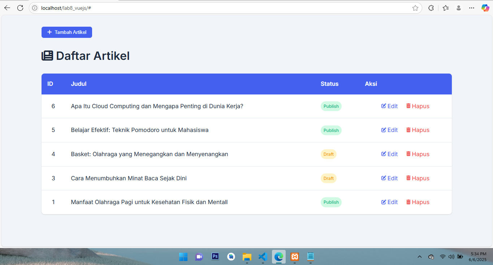

**Menambah data**
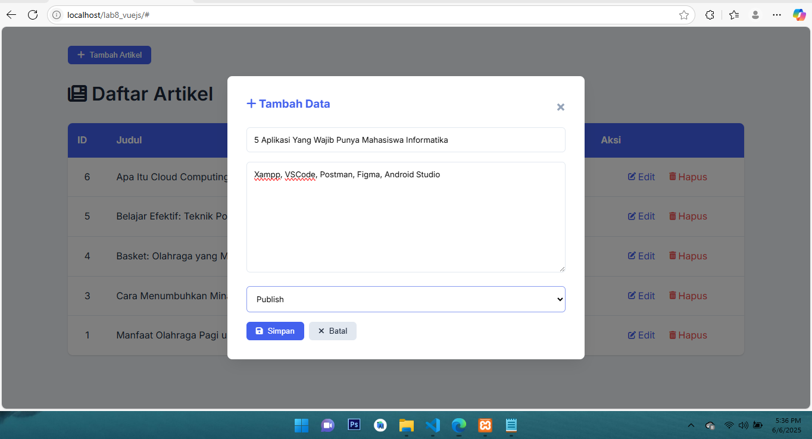

**Mengedit data**
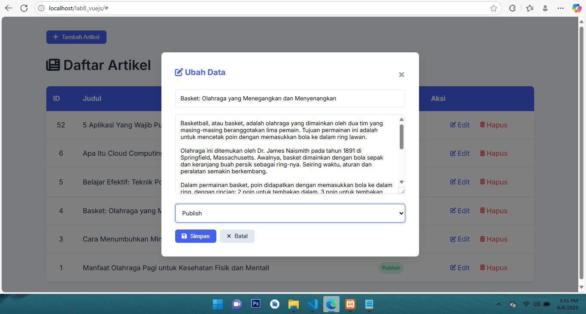

**Menghapus data**
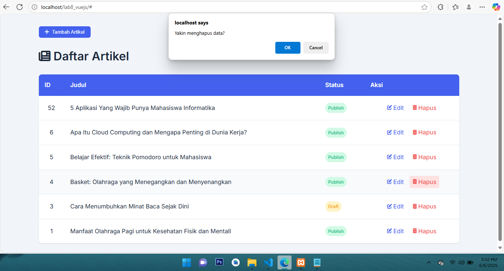

---

### ‚úÖ Kesimpulan

- VueJS sangat cocok digunakan untuk membangun aplikasi frontend yang ringan, modular, dan reaktif.

- Praktikum ini memperlihatkan bagaimana VueJS dan Axios dapat bekerja sama untuk membuat aplikasi CRUD sederhana dengan REST API.

- Dengan menggunakan v-model, v-if, v-for, dan @click, interaksi antara data dan tampilan dapat dikelola dengan mudah.

- VueJS versi 3 menyediakan cara yang modern dan efisien untuk membuat aplikasi dinamis tanpa memerlukan tool build tambahan seperti Webpack.

- Pemahaman konsep API dan cara menghubungkannya ke frontend merupakan keterampilan fundamental dalam pengembangan web modern.
